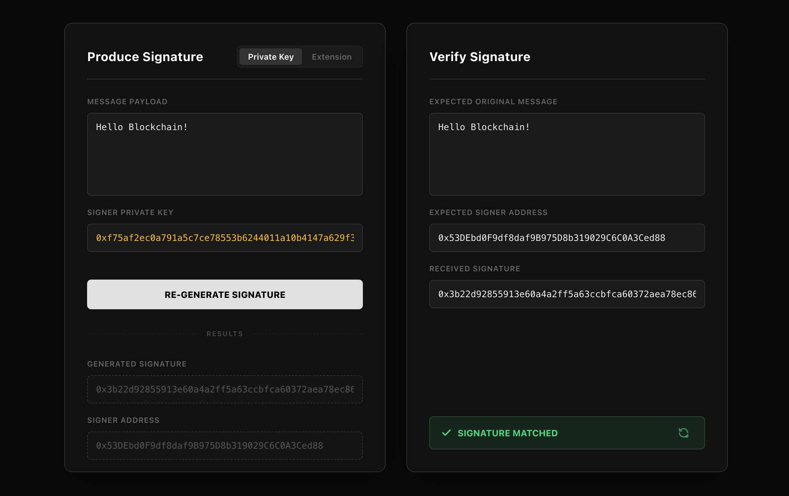

# eth-sign-verify

A minimal, offline-first Ethereum signature generator and verifier. Built for developers to quickly test EIP-191 signatures and verify ownership without interacting with the blockchain.



## Overview

This tool solves the friction of testing web3 signatures. Instead of writing one-off scripts or dealing with clunky online converters, **eth-sign-verify** provides a clean interface to generate signatures using raw private keys or wallet extensions, and immediately verify them in a stateless environment.

## Features

### ✍️ Produce Signature
- **Dual Signing Modes**:
  - **Private Key**: Sign messages using a raw private key. Inputs are visually obscured but treated as text to prevent browser password manager interference.
  - **Extension**: Sign using connected browser wallets (MetaMask, Rabby, etc.) via standard EIP-1193 requests.
- **Auto-Formatted Payloads**: Comes with a default JSON payload structure, but supports any string input.
- **Output Results**: Instantly generates the `Signature` and the derived `Signer Address`.

### 🔍 Verify Signature
- **Stateless Verification**: Uses cryptographic logic to recover the address from the signature and message. No backend required.
- **Visual Feedback**: Clear, color-coded status indicators for **Matched** (Green), **Mismatch** (Red), and **Format Error** (Yellow).
- **Workflow Efficiency**: Includes a **"Fill to Verifier →"** button to instantly transfer generated data to the verification panel for immediate testing.

## Tech Stack

- **Framework**: React + Vite
- **Language**: TypeScript
- **Crypto Library**: [viem](https://viem.sh/) (Lightweight, type-safe alternative to Ethers.js)
- **Styling**: Pure CSS (No external UI libraries)

## Getting Started

### Prerequisites

- Node.js (v18 or higher)
- pnpm (recommended) or npm

### Installation

1. **Clone the repository**
   ```bash
   git clone https://github.com/your-username/eth-sign-verify.git
   cd eth-sign-verify
   ```

2. **Install dependencies**
   ```bash
   pnpm install
   # or
   npm install
   ```

3. **Start the development server**
   ```bash
   pnpm dev
   # or
   npm run dev
   ```

Open your browser and navigate to http://localhost:5173.

### Security Note
⚠️ Private Key Safety: This application runs entirely client-side. Private keys entered into the interface are processed strictly within your browser's memory using viem and are never transmitted to any server.

However, as a best practice for all development tools: Never enter a private key containing real Mainnet assets. Please use testnet accounts or ephemeral development keys only.

### License
MIT License.